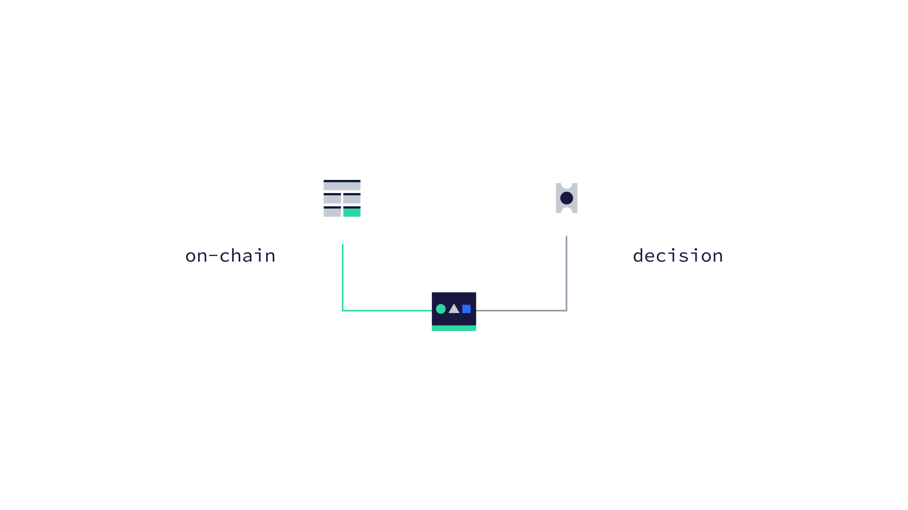
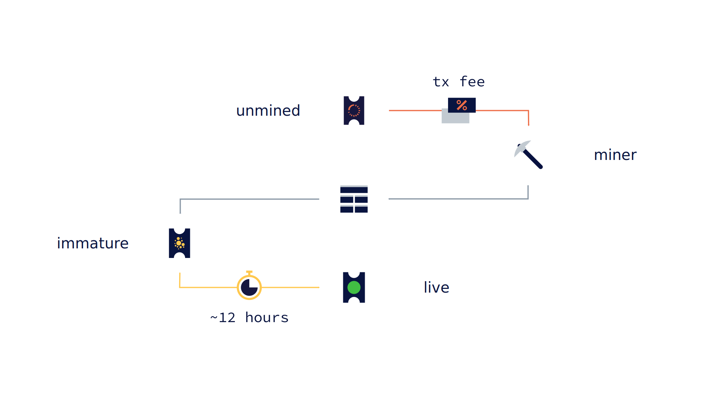
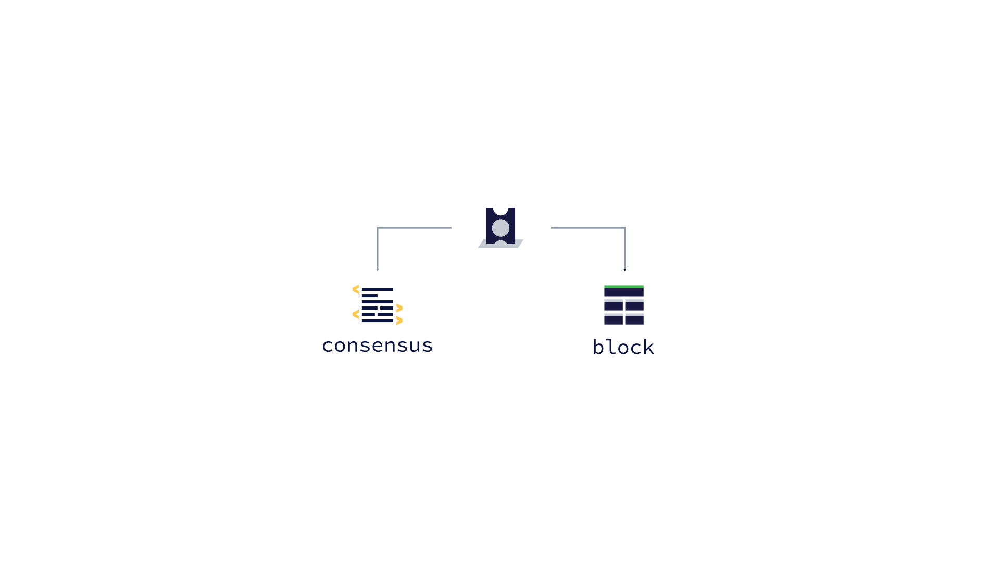
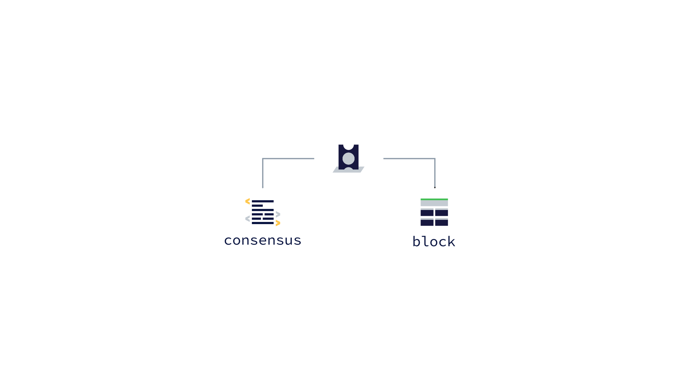
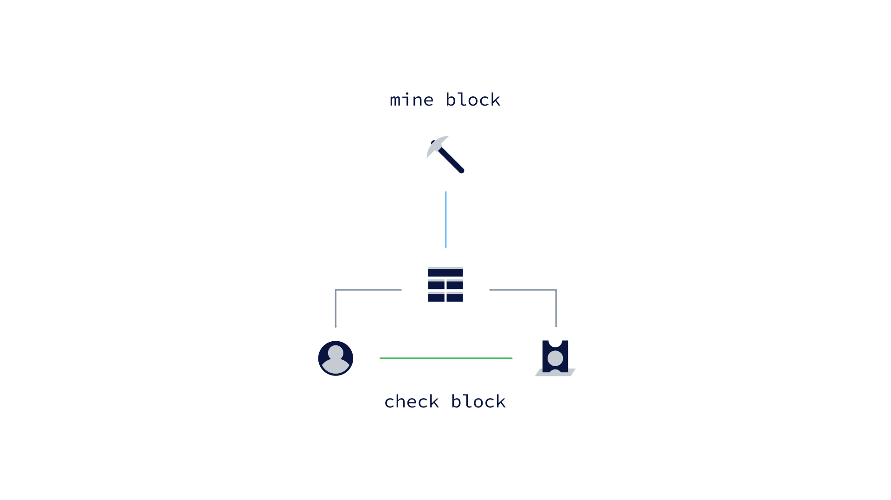
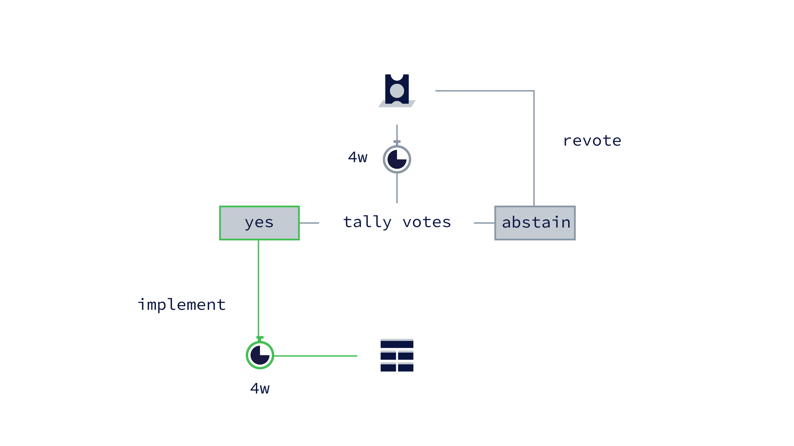
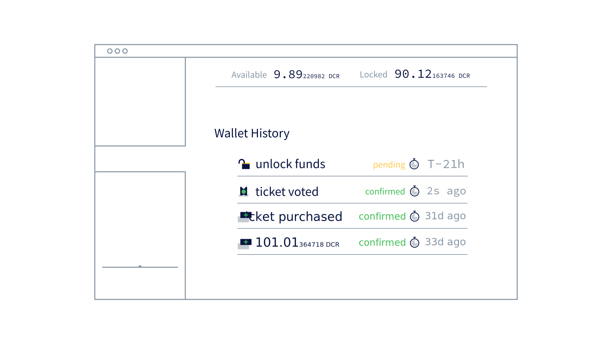

## Decred: Proof-of-Stake

### Storyboard
**Estimated Runtime:** 1.8 minutes

No. | VISUAL | AUDIO | TIME
:-: | :----: | :---- | :--:
1 |  | **VO:** is an on-chain decision making system **action:** "on-chain" and block icon appear first then "decision" and votes icon. They are then connected by the line. | 3 
2 |  | **VO:** is an on-chain decision making system **action:** "on-chain" and block icon appear first then "decision" and votes icon. They are then connected by the line. | 5 
3 |  | **VO:** Where participants purchase tickets for a chance to have their voice heard. **action:** "on-chain decision" blinks out. Wallet icon appears pushing the schematic to the left, followed by the purchase ticket icon, pushing the schematic down. A line connects them. | 6 
4 | Ultra simplified mockup of wallet software with `spendable dcr balance`, `current ticket price`, `# owned tickets` and greyed out `purchase ticket` button. | **VO:** to purchase a ticket, participants must have enough Decred to cover the current ticket price. **action:** `spendable balance` and `ticket price` 'sync'. The `balance` is higher than the `price` and the `purchase ticket` button turns from grey to green. | 3 
5 |  | **VO:** Every 144 blocks, a new ticket price is calculated by a pricing algorithm to keep the total number of active tickets equal to the target size. **action:** Entire schematic 'blinks on'. Timer counts up to 144 blocks and activates the algorithm. Price is lowered. Timer counts up again, then price is increased. | 3 
6 | Same as scene 6. | **VO:** If the participant's balance is high enough, a portion equal to the current ticket price may be locked in exchange for a ticket. Locked funds can not be spent for the duration of the ticket lifecycle. **action:** Purchase ticket button is pressed. `Spendable balance` is subtracted by `ticket price.` `Ticket count` increases by 1. | 7
7 | Mockup of send tx view in Decrediton showing `total balance` and `spendable balance` | **VO:** Locked funds can not be spent for the life of the corresponding ticket. **action:** A tx with an amount less than the total balance but greater than the spendable balance is attempted. An error message appears saying `not enough spendable funds` | 5 
8 | violin graph of ticket lifespans. | **VO:** How long a ticket lives in the system is largely up to chance, but averages 30 days. **action:** Graph is drawn out. | 5 
9 |  | A ticket's life begins after it is mined into a block. How long a ticket must wait to be mined is determined by the transaction fee paid when it was purchased. Once included in a block, a ticket is considered immature and must wait about 12 hours before it becomes live and is added to the ticket pool. | 3 
10 | Simple representation of ticket pool with dice used to show randomness. | The ticket pool is where live tickets wait to be chosen to vote. Every 5 minutes, using arbitrary entropy from the blockchain, 5 tickets are randomly drawn from the pool to vote. | 3
11 |  | Once their ticket is drawn, a participant's votes are broadcast to the network by their chosen voting service provider for inclusion in the next block. | 5
12 |  | There are two on-chain voting processes to participate in: block votes and consensus votes. | 7 
13 |  | Block votes provide a mechanism for participants to keep nonconforming proof-of-work miners in check. | 8 
14 |  | 5 votes in each new block decide whether to reject the previous block. If the block is rejected, the founding miner will not receive their part of the block reward. | 8 
15 |  | Consensus voting is a two stage process where participants vote for or against the implementation of changes to the Decred network. | 5 
16 |  | if enough nodes upgrade within the upgrade phase interval, voting commences. If 75% of votes signal yes within the voting interval, then the changes are ratified and will be automatically implemented after another block interval. | 5 
17 |  | After a participant's block and consensus votes have been cast, the funds used to purchase the ticket are unlocked and a portion of the block reward is credited to their account. | 7
18 |   | Other decisions not involving consensus rule changes, such as how to spend the project subsidy fund are decided through Politeia, the Decred proposal system. | 7 
19 |   | Through their wallet, participants with live tickets can vote to approve or deny Politeia proposals. | 7 
20 |  | To begin participating in Decred proof-of-stake | 4 
21 |   | download Decrediton at Decred.org  | 4 
22 |   | and purchase Decred at any one of the many supporting exchanges. | 6
23 |  | Decred; Decentralized Credits. | 3
